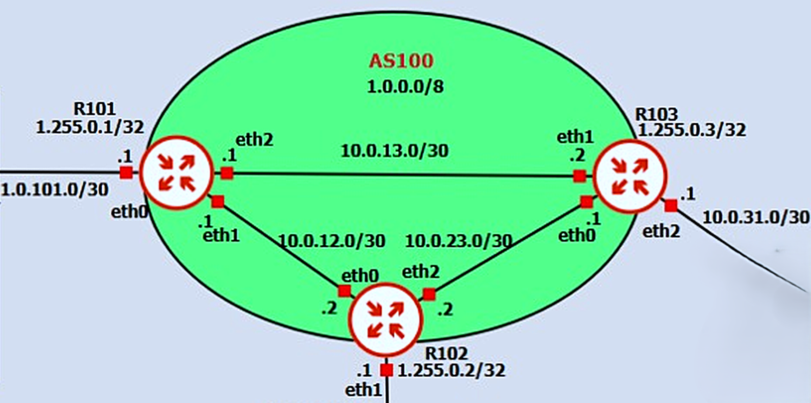
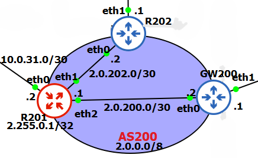
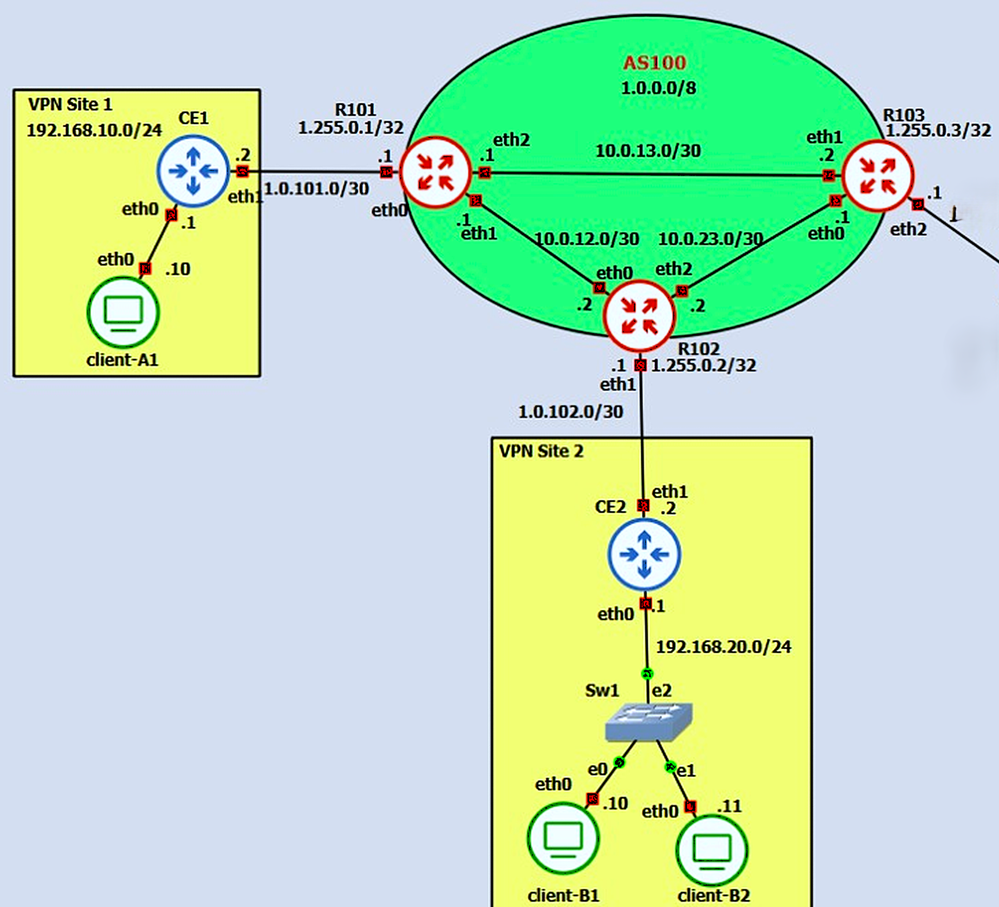
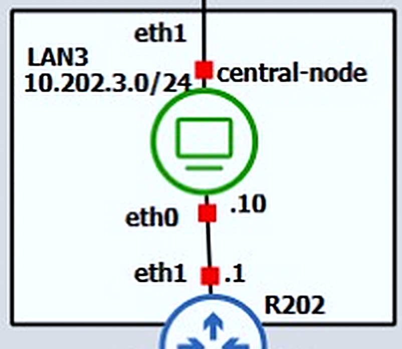
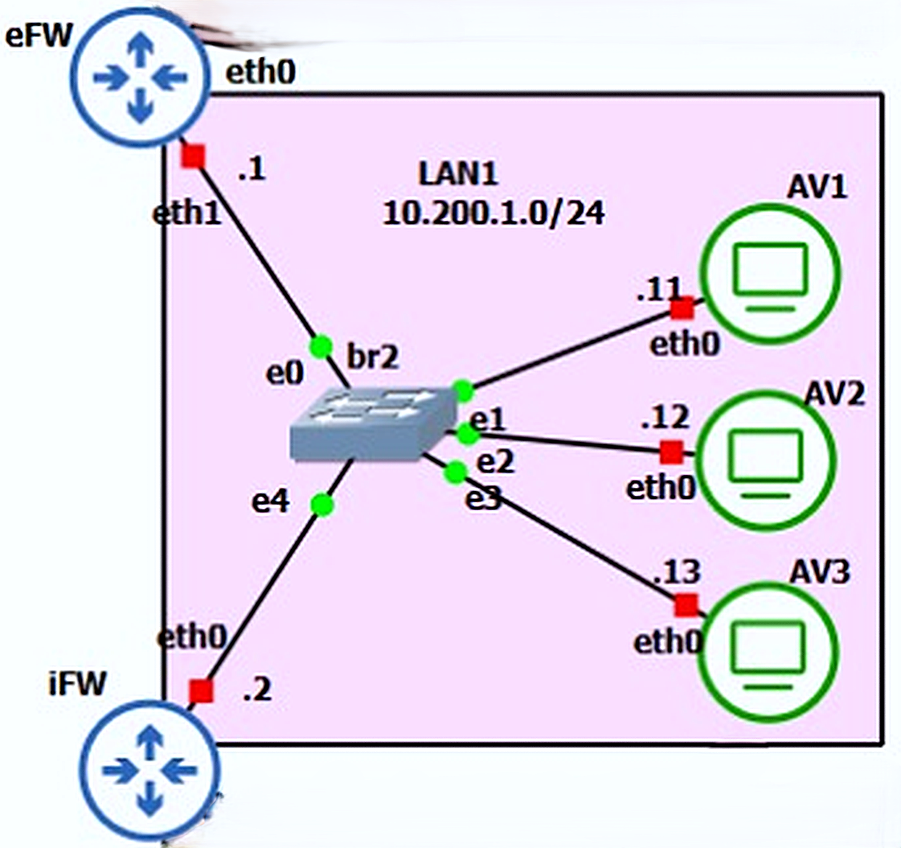

NSD Project `2025/26` (GNS3)
================================

Architettura e Obiettivi del Progetto
-------------------------------------

La presente documentazione descrive il progetto del corso di **Network and System Defense (NSD)** `2025/26` implementato su piattaforma **GNS3**. L’architettura di rete realizzata rappresenta uno scenario multi-dominio con due Autonomous System interconnessi (`AS100` e `AS200`) e include numerose componenti di **routing** e **sicurezza** avanzate. L’obiettivo è progettare e configurare una rete sicura che integri routing dinamico e meccanismi di difesa a più livelli, garantendo la connettività tra sedi diverse e la protezione dei servizi critici. In particolare, la topologia comprende i seguenti elementi principali:

*   **`AS100` (Provider)** – Backbone con tre router FRR (`R101`, `R102`, `R103`) che eseguono routing dinamico interno tramite OSPF (area 0) e iBGP (full-mesh tra i border router), oltre a un peering eBGP esterno con `AS200`. `AS100` funge anche da **provider** per un cliente con due sedi remote (Site1 e Site2), alle quali assegna indirizzi pubblici dedicati e connettività tramite link dedicati (subnet `/30`) verso i router customer edge `CE1` e `CE2`.
    
*   **`AS200` (Enterprise)** – Rete di un’organizzazione enterprise connessa lateralmente ad `AS100`. Include i router `R201` (border BGP verso `AS100`), `R202` (router interno) e `GW200` (gateway perimetrale). Internamente, `AS200` utilizza rotte statiche/default (`R202` e `GW200` instradano il traffico tramite `R201`).
    
*   **Enterprise Network (`AS200`)** – Comprende diverse sotto reti locali protette da firewall: una **DMZ** (Demilitarized Zone) su cui risiede un server DNS autorevole con **DNSSEC** attivo e un server web Apache (raggiungibile all’URL _www.nsdcourse.xyz_), una **`LAN1`** interna che ospita diversi nodi **antivirus (`AV`)**, una **`LAN2`** con client utente e una **`LAN3`** con un nodo di controllo centrale. Il firewall perimetrale esterno `eFW` gestisce il traffico tra `DMZ` e `LAN1`, mentre un firewall interno `iFW` separa `LAN1` e `LAN2`.
    
*   **Security Policy (`Firewall`)** – Viene implementata una politica di firewalling **stateful** secondo le specifiche di progetto: il firewall esterno (`eFW`) e il gateway `GW200` consentono in ingresso dalla rete esterna _solo_ il traffico DNS e HTTP destinato al server DNS/Web in DMZ, oltre al traffico VPN IPsec verso `eFW`. Il firewall interno (`iFW`) limita il traffico tra le LAN interne secondo criteri di minima esposizione: ad esempio, il client in `LAN2` può uscire solo verso Internet/DMZ con connessioni originate internamente (policy **outbound only**), e gli host AV in `LAN1` sono isolati tra loro permettendo solo comunicazioni con il `central-node` in `LAN3` (instradate via VPN). Tutto il traffico non esplicitamente consentito è bloccato.
*   **`VPN IPsec` (Enterprise)** – Connessione **site-to-site** tra `R202` (`AS200`) e `eFW` (firewall esterno in `DMZ`) per proteggere la comunicazione end-to-end tra la `LAN3` (`central-node`) e `LAN1` (AV). Implementazione basata su **strongSwan** in modalità tunnel con configurazione tramite _swanctl_ (PSK pre-condivisa).
*   **`VPN IPsec` (Customer)** – Connessione **site-to-site** tra i router customer edge `CE1` (Site1) e `CE2` (Site2) del cliente (collegati ad `AS100`) per garantire connettività sicura tra le due sedi remote attraverso la rete del provider. Anch’essa realizzata con strongSwan (PSK) in modalità tunnel.
    
*   **`MACsec` con MKA** – Cifratura e integrità a livello **Layer2** sulla LAN del Site2 (tra `CE2`, `client-B1` e `client-B2`) tramite il protocollo MACsec (IEEE 802.1AE) con gestione chiavi automatizzata (**MKA**). Questa misura protegge il traffico locale nel segmento di Site2 da potenziali attacchi L2 (sniffing, man-in-the-middle). L’implementazione utilizza _wpa\_supplicant_ con chiavi pre-condivise per creare un’interfaccia crittografata `macsec0` su ciascun nodo della LAN, spostando lì gli indirizzi IP della rete locale.
    
*   **`Antivirus` Sandbox (`LAN1` & `LAN3`)** – Un’infrastruttura di sandbox distribuita per l’**analisi di malware**: tre nodi “runner” (`AV1`, `AV2`, `AV3` in `LAN1`) ciascuno con un diverso software antivirus, e un nodo centrale di orchestrazione (`central-node` in `LAN3`). L’utente può inviare un file sospetto al central-node, il quale lo distribuisce ai runner AV per la scansione; i risultati sono poi raccolti e riportati all’utente. Per garantire un ambiente di analisi sempre pulito, i runner AV vengono **ripristinati tramite snapshot** a uno stato iniziale dopo ogni esecuzione di test. L’intera comunicazione tra il `central-node` e i runner AV avviene cifrata attraverso la VPN IPsec enterprise (`LAN3` ↔ `LAN1`).
    
    

In sintesi, il progetto fornisce un ambiente di rete completo con **routing dinamico** tra domini e sotto reti, **segmentazione** tramite `DMZ` e firewall, **servizi sicuri** (DNSSEC, web) per utenti esterni, **comunicazioni cifrate** tra sedi (VPN, MACsec) e un sistema di **sandbox AV** per la sicurezza pro attiva. La sezione seguente illustra la topologia e, successivamente, vengono dettagliati i singoli aspetti con indicazioni tecniche, comandi di verifica e riferimenti alla documentazione di supporto.

* * *

Topologia
---------


### Naming dei nodi

**AS100**
*   `R101`, `R102`, `R103` (router core – OSPF area 0, iBGP full-mesh)

**AS200**
*   `R201`, `R202` (router enterprise), `GW200` (gateway edge enterprise)

**Enterprise Net (AS200)**
*   `eFW` – **edge Firewall** (firewall perimetrale + endpoint VPN IPsec enterprise)
*   `iFW` – **internal Firewall** (firewall interno `LAN1`/`LAN2`)
*   `DNS-server` – server `DMZ` (DNS autoritativo + web HTTP)
*   `LAN-client` – client utente in `LAN2` (rete interna)
*   `AV1`, `AV2`, `AV3` – runner Antivirus in `LAN1`
*   `central-node` – nodo centrale di orchestrazione in `LAN3`
    

**Customer VPN**
*   `CE1` – router Customer Edge Site1
*   `CE2` – router Customer Edge Site2
*   `client-A1` – host client in Site1 LAN
*   `client-B1`, `client-B2` – host client in Site2 LAN
*   `Sw1` – switch L2 (bridge) in Site2 LAN

**Bridges (GNS3)**
*   `br1` – switch/bridge `DMZ`
*   `br2` – switch/bridge `LAN1`
*   `br3` – switch/bridge `LAN2`

* * *
Comandi di verifica rapidi
--------------------------
Di seguito alcuni comandi essenziali per verificare rapidamente lo stato delle principali funzionalità implementate.

### Routing (AS100 e inter-AS)
Da eseguire su ciascun router di `AS100` (`R101`, `R102`, `R103`):
```bash
vtysh -c "show ip ospf neighbor"    # Verifica adiacenze OSPF area 0
vtysh -c "show ip bgp summary"      # Verifica sessioni iBGP/eBGP e stato BGP
vtysh -c "show ip route"            # Verifica tabella di routing unificata`
```
### Servizi DMZ (DNSSEC + HTTP)
Da un host interno con accesso `DMZ` (es. `LAN-client` in `LAN2`):
```bash
dig +dnssec @2.80.200.3 www.nsdcourse.xyz A   # Query DNS con verifica DNSSEC
curl -v http://www.nsdcourse.xyz             # Richiesta HTTP al web server in DMZ`
```
### VPN IPsec Enterprise (R202 ↔ eFW)
Su `R202` **e** `eFW` (estremi VPN enterprise):
```bash
swanctl --list-sas    # Elenco Security Association attive (tunnel IPsec)`
```
_Opzionale, per forzare l’instaurazione del tunnel:_ eseguire su `R202`:
```bash
swanctl --initiate --child lan-lan   # Avvia la child SA "lan-lan" manualmente`
```
### VPN IPsec Customer (CE1 ↔ CE2)
Su entrambi i router `CE1` e `CE2`:
```bash
swanctl --list-sas    # Verifica tunnel IPsec site-to-site tra CE1 e CE2`
```
### MACsec (Site2 LAN)
Da qualsiasi nodo di Site2 (es. `client-B1`):
```bash
ip -s link show macsec0   # Mostra statistiche interfaccia MACsec (contatori RX/TX)
ping 192.168.20.1         # Test con ping verso CE2 sulla LAN protetta`
```
_(I contatori MACsec RX/TX incrementano se il traffico è cifrato con successo.)_

* * *

Piano di indirizzamento (sintesi)
---------------------------------

> Dettagli completi in: [`docs/01-addressing-plan.md`](./docs/01-addressing-plan.md)  
> **Nota:** i prefissi `1.0.0.0/8` e `2.0.0.0/8` sono utilizzati **esclusivamente** in ambito di laboratorio (non instradati su Internet).

*   **Pool di indirizzi pubblici (laboratorio):** 
    *   **AS100:** `1.0.0.0/8` (indirizzi pubblici assegnati a provider e link verso `CE1`/`CE2`)
    *   **AS200:** `2.0.0.0/8` (indirizzi pubblici assegnati all’enterprise, es. `DMZ`)
*   **Pool indirizzi di interconnessione (P2P):** `10.0.0.0/16` suddiviso in `/30` per link router-router privati (intranet).
    

### Indirizzi principali per segmento
**Enterprise Net (`AS200`):**
*   **`DMZ`:** `2.80.200.0/24`
    *   `GW200` (interfaccia verso `DMZ`): `2.80.200.1`
    *   `eFW` (interfaccia esterna verso `DMZ`): `2.80.200.2`
    *   `DNS-server` (host `DMZ`): `2.80.200.3` (autorità DNS e web)
*   **`LAN1` (Antivirus):** `10.200.1.0/24`
    *   `eFW` (interfaccia interna `LAN1`): `10.200.1.1`
    *   `iFW` (interfaccia esterna `LAN1`): `10.200.1.2`
    *   `AV1–AV3`: `10.200.1.11/12/13` 
*   **`LAN2` (Client interno):** `10.200.2.0/24`
    *   `iFW` (interfaccia interna `LAN2`): `10.200.2.1`
    *   `LAN-client`: `10.200.2.10` 
*   **`LAN3` (Central management):** `10.202.3.0/24`
    *   `R202` (gateway `LAN3`): `10.202.3.1`
    *   `central-node`: `10.202.3.10` 

**Customer VPN:**
*   **Site1 LAN:** `192.168.10.0/24`
    *   `CE1`: `192.168.10.1` (gateway Site1)
    *   `client-A1`: `192.168.10.10`
*   **Site2 LAN:** `192.168.20.0/24`
    *   `CE2`: `192.168.20.1` (gateway Site2)
    *   `client-B1`: `192.168.20.10`, `client-B2`: `192.168.20.11`

>_Nota:_ quando MACsec è abilitato, questi indirizzi sono assegnati sulle interfacce `macsec0` (anziché `eth0`).

**Link di peering e interconnessioni:**
*   **`AS100` ↔ Customer Site1:** `1.0.101.0/30` (link WAN tra `R101` e `CE1`)
*   **`AS100` ↔ Customer Site2:** `1.0.102.0/30` (link WAN tra `R102` e `CE2`)
*   **`AS100` ↔ `AS200` (eBGP):** `10.0.31.0/30` (link tra `R103` (`10.0.31.1`) e `R201` (`10.0.31.2\`))
*   **`AS200` interno:**
    *   Link `R201 ↔ GW200`: `10.0.200.0/30` (`R201`: `10.0.200.1`, `GW200`: `10.0.200.2`)
    *   Link `R201 ↔ R202`: `10.0.202.0/30` (`R201`: `10.0.202.1`, `R202`: `10.0.202.2`)

* * *

Routing (sintesi)
-----------------
> Documentazione di dettaglio e configurazioni: [`docs/02-routing.md`](./docs/02-routing.md)  
> **Verifica:** utilizzare i comandi _vtysh_ mostrati sopra per controllare lo stato di OSPF e BGP.

Il dominio AS100 implementa un **IGP OSPF** per l’instradamento interno e un **BGP** (iBGP/eBGP) per lo scambio di rotte sia all’interno dell’AS che con l’esterno:
*   **OSPF (`AS100`):** i tre router `R101`, `R102`, `R103` formano un’area OSPF 0 comune, annunciando le reti di transito `/30` tra di loro e le rispettive loopback. Ogni router utilizza un router-id (RID) univoco corrispondente alla propria loopback (es. `1.255.0.x`). Tutte le interfacce sono impostate come _passive_ a eccezione dei link punto-punto verso gli altri router core (per ridurre il flooding OSPF solo alle interfacce coinvolte). 
*   **iBGP (`AS100`):** i medesimi router di `AS100` stabiliscono sessioni iBGP in full-mesh usando le interfacce di loopback come indirizzi peer (ridondanza e indipendenza dal link fisico). Ad esempio, `R101`, `R102` e `R103` hanno peer iBGP rispettivamente sulle IP `1.255.0.2` (`R102`) e `1.255.0.3` (`R103`), etc., con l’opzione `update-source lo` abilitata su ogni sessione affinché il traffico BGP sia originato dall’IP di loopback. Inoltre, su `R103` (punto di uscita verso `AS200`) è configurato `next-hop-self` verso i suoi peer iBGP, in modo da riscrivere come _next-hop_ il proprio indirizzo (anziché quello dei CE o altre reti) per le rotte apprese esternamente – garantendo che `R101`/`R102` inoltrino correttamente il traffico esterno verso `R103`.
*   **eBGP (`AS100` ↔ `AS200`):** è attivato un peering BGP esterno tra `R103` (`AS100`) e `R201` (`AS200`) sul link condiviso `10.0.31.0/30`. `AS100` annuncia verso `AS200` i propri prefissi “pubblici” (ad esempio l’intero blocco `1.0.0.0/8` come aggregato, includendo le subnet `/30` verso `CE1` e `CE2`), mentre **`AS200`** annuncia ad `AS100` la rete della `DMZ` `2.80.200.0/24` (così che sia raggiungibile dai client attraverso `AS100`). `R201` in `AS200` non esegue un IGP completo: per distribuire la connettività all’interno di `AS200`, si utilizzano rotte statiche – ad esempio, `R201` ha rotte statiche per inoltrare il traffico destinato alla `DMZ` e alle LAN interne (`LAN1`, `LAN2`, `LAN3`) verso `GW200` o `R202` a seconda del caso. Analogamente, `R202` e `GW200` puntano di default tutto il traffico destinato fuori dalle proprie LAN verso `R201`. 

Di seguito è riportato un estratto semplificato della configurazione BGP su `R103` (`AS100`), che evidenzia la definizione dei peer iBGP interni su loopback e del peer eBGP esterno (`AS200`):
```bash
router bgp 100
  bgp router-id 1.255.0.3
  ! iBGP interno (AS100 - full mesh)
  neighbor 1.255.0.1 remote-as 100
  neighbor 1.255.0.1 update-source lo
  neighbor 1.255.0.2 remote-as 100
  neighbor 1.255.0.2 update-source lo
  ! eBGP esterno verso AS200
  neighbor 10.0.31.2 remote-as 200
  ...
  address-family ipv4 unicast
    neighbor 1.255.0.1 activate
    neighbor 1.255.0.2 activate
    neighbor 10.0.31.2 activate
    neighbor 1.255.0.1 next-hop-self
    neighbor 1.255.0.2 next-hop-self
    network 1.0.0.0/8
```
>_Per la configurazione completa di OSPF/BGP, si vedano gli script in [`scripts/out/routing/`](./scripts/out/routing) e i file di configurazione FRR salvati in [`project/configs/`](./project/configs)._

* * *

Firewall policy (sintesi)
-------------------------

> Descrizione estesa delle policy e flussi: [`docs/03-firewall-policy.md`](./docs/03-firewall-policy.md)  
> **Verifica:** ispezionare le regole attive su ogni firewall con `iptables -L -v -n` oppure effettuare test di connettività (es. dal `LAN-client` verificare che richieste consentite – DNS/HTTP verso `DMZ` – abbiano esito positivo, mentre traffico proibito venga bloccato).

La **politica di sicurezza** è applicata tramite un firewall perimetrale esterno (`eFW`), un gateway edge (`GW200`) e un firewall interno (`iFW`), con regole _stateful_ che consentono solo i flussi esplicitamente autorizzati:
*   **Ingresso dalla rete esterna verso DMZ/Enterprise:** consentito solo traffico **DNS** (UDP/TCP porta `53`) e **HTTP** (TCP porta `80`) destinato al server in `DMZ` (`DNS-server` – IP `2.80.200.3`), oltre al traffico **IPsec** verso il firewall esterno `eFW` (IP `2.80.200.2`) sulle porte UDP `500/4500` e protocollo ESP. Qualsiasi altro traffico in ingresso da `AS100`/Internet è scartato dai filtri su `GW200`/`eFW`. 
*   **LAN interna (`LAN2`) verso esterno:** il client `LAN-client` in `LAN2` è autorizzato ad accedere a Internet e `DMZ` **solo per connessioni originate dalla LAN interna** (regola stateful: le risposte sono permesse). Tentativi di connessione _in ingresso_ verso `LAN2` non sono ammessi (dato che i firewall hanno policy di default **DROP**).
*   **Traffico AV (`LAN1` ↔ `LAN3`):** gli host antivirus in `LAN1` (`AV1-3`) sono **isolati** dal resto della rete locale; è permesso **solo** il traffico tra `LAN1` e `LAN3`, necessario alla comunicazione **AV ↔ `central-node`**. In particolare, `eFW` e `iFW` consentono il transito delle connessioni tra gli IP di `LAN1` (`10.200.1.0/24`) e `LAN3` (`10.202.3.0/24`) – questo traffico viene cifrato via VPN IPsec (vedi sezione successiva). 
*   **NAT:** Il gateway `GW200` effettua NAT (masquerading) per il traffico originato dalle reti enterprise verso l’esterno (ad esempio, la `DMZ` o `LAN2` che accedono a Internet tramite `AS100` useranno come sorgente l’IP pubblico di `GW200`). Ciò assicura che le risposte tornino correttamente e nasconde gli IP interni.

Le regole firewall sono implementate tramite script di configurazione `iptables` su macchine Linux. Di seguito un estratto di configurazione di `GW200` che illustra la politica di default restrittiva e alcune regole chiave (stateful inspection e aperture mirate):
```bash
# Politica di default: DROP su INPUT/FORWARD, ACCEPT su OUTPUT
iptables -P INPUT DROP
iptables -P FORWARD DROP
iptables -P OUTPUT ACCEPT

# Regola stateful generale (consente pacchetti di risposta)
iptables -A FORWARD -m state --state ESTABLISHED,RELATED -j ACCEPT

# Regole DMZ/servizi consentiti (Internet -> DMZ)
iptables -A FORWARD -i eth0 -d 2.80.200.3 -p udp --dport 53 -j ACCEPT    # DNS
iptables -A FORWARD -i eth0 -d 2.80.200.3 -p tcp --dport 80 -j ACCEPT    # HTTP
iptables -A FORWARD -i eth0 -d 2.80.200.2 -p udp --dport 500 -j ACCEPT   # IPsec (IKE)
iptables -A FORWARD -i eth0 -d 2.80.200.2 -p udp --dport 4500 -j ACCEPT  # IPsec (NAT-T)
iptables -A FORWARD -i eth0 -d 2.80.200.2 -p esp -j ACCEPT               # IPsec (ESP)

# Regola LAN2 -> Internet (consenti traffico uscente di LAN-client)
iptables -A FORWARD -i eth1 -o eth0 -s 10.200.2.0/24 -j ACCEPT

# NAT: masquerade su traffico in uscita verso Internet (eth0)
iptables -t nat -A POSTROUTING -o eth0 -j MASQUERADE`
```
>_Nell’estratto: `eth0` indica l’interfaccia di `GW200` verso `R201`/`AS100`, e `eth1` l’interfaccia interna verso `DMZ`/LAN. Configurazioni simili sono applicate su `eFW` e `iFW` secondo la policy prevista – vedi script in [`scripts/out/firewall/`](scripts/out/firewall)._

* * *

DMZ: DNS autorevole (DNSSEC) + HTTP web server
----------------------------------------------

> Dettagli implementativi: [`docs/04-dns-dnssec-web.md`](./docs/04-dns-dnssec-web.md)  
> **Verifica:** dal client interno (`LAN-client`) eseguire query DNS e richieste HTTP come mostrato nei _Comandi di verifica_ (sezione precedente) e controllare che la risoluzione DNS (con validazione DNSSEC) e l’accesso web funzionino correttamente.

In DMZ è presente un server denominato `DNS-server` (IP `2.80.200.3`) che svolge due funzioni: **DNS autoritativo** per il dominio _nsdcourse.xyz_ (con supporto **DNSSEC**) e **server web HTTP** (Apache) per il sito _www.nsdcourse.xyz_. Questo server rappresenta un punto di demarcazione nella zona pubblica (`DMZ`) accessibile dall’esterno, soggetto alle regole restrittive del firewall perimetrale.
*   **DNS Autorevole con DNSSEC:** Il server DNS in DMZ risponde authoritative alle query per _nsdcourse.xyz_. La zona è firmata digitalmente mediante DNSSEC: sono stati generati coppie di chiavi KSK/ZSK (algoritmo ECDSA P-384) e i record **DNSKEY** sono stati inseriti nella zona, che viene poi firmata con _dnssec-signzone_. In questo modo, un resolver che effettua query con **DNSSEC enabled** (ad esempio usando `dig +dnssec`) può ricevere i record RRSIG e verificare l’autenticità della risposta. _(Nota: il dominio è fittizio e non delegato nella root DNS; non è quindi previsto l’inserimento di DS record in una zona padre – la verifica DNSSEC può essere simulata configurando il resolver locale con il trust anchor della zona firmata.)_
*   **Web Server HTTP:** Sullo stesso host gira un servizio Apache2 che ospita una semplice pagina web, resa disponibile all’URL `http://www.nsdcourse.xyz`. Nel file DNS, _www_ è configurato come record A che punta all’IP del DNS-server stesso, così da risolvere il nome e consentire al client di raggiungere il sito tramite la `DMZ`. Il traffico HTTP in ingresso (porta `80`) è filtrato dal firewall `GW200` e inoltrato solo se destinato al server in `DMZ`. Il client interno (`LAN-client`) può quindi effettuare richieste HTTP verso _www.nsdcourse.xyz_ passando attraverso i firewall (che permettono tale traffico in uscita essendo originato dalla LAN interna).

Configurazione DNS principale (estratto semplificato): il dominio _nsdcourse.xyz_ è definito come zona master nel Bind **named** del DNS-server, con i record necessari e la firma DNSSEC applicata. Ad esempio, nel file di zona si trovano i record NS e A, e dopo la firma compaiono anche i record DNSSEC (DNSKEY, RRSIG, etc.). Nel _named.conf_ del server è specificato l’uso del file di zona firmato:
```bash
zone "nsdcourse.xyz" {
  type master;
  file "/etc/bind/db.nsdcourse.xyz.signed";  # Zona firmata con DNSSEC
};
```
>_Vedere [`scripts/out/dns/`](./scripts/out/dns) per gli script e file di configurazione DNS: ad esempio `named.conf.local`, `db.nsdcourse.xyz`, e lo script di inizializzazione DNSSEC._

**Test:** per verificare il funzionamento, dal `LAN-client` si esegue una query DNS con dig includendo l’opzione `+dnssec` e specificando come server autoritativo 2.80.200.3, ad esempio:

```bash
dig +dnssec @2.80.200.3 www.nsdcourse.xyz A`
```
La risposta dovrebbe includere il record 'A' richiesto e i relativi record RRSIG. Successivamente, un semplice `curl http://www.nsdcourse.xyz` dovrebbe restituire il contenuto della pagina web di test ospitata su DNS-server (verificando che la risoluzione DNS e la reachability HTTP siano corrette). Entrambi i test confermano il corretto setup di DNSSEC e del servizio web in DMZ.

* * *

VPN IPsec (Enterprise & Customer)
---------------------------------

> Dettagli operativi e configurazioni: [`docs/05-vpn-ipsec.md`](docs/05-vpn-ipsec.md)  
> **Verifica:** su ciascun endpoint IPsec eseguire `swanctl --list-sas` per elencare le Security Association attive. È inoltre possibile consultare i log di strongSwan o utilizzare `tcpdump` per vedere il traffico ESP incapsulato.

Sono implementati due tunnel **IPsec site-to-site**: uno tra la rete Enterprise (AS200) e la propria DMZ (Enterprise VPN), e uno tra le due sedi del Customer (Customer VPN). Entrambi utilizzano **strongSwan** (IKEv2) con autenticazione tramite PSK e sono configurati in modalità tunnel per cifrare interamente il traffico tra le sotto reti interessate.

### Enterprise VPN (R202 ↔ eFW)
Questo tunnel IPsec collega la `LAN3` di `AS200` (sede del _`central-node`_) con la `LAN1` (dove risiedono gli host AV) passando attraverso il firewall perimetrale. Gli endpoint della VPN sono `R202` (IP locale `10.0.202.2` sul link verso `R201`) e `eFW` (IP pubblico `2.80.200.2` in `DMZ`). Il tunnel protegge quindi le sotto reti **`10.202.3.0/24`** (`LAN3`, lato `R202`) e **`10.200.1.0/24`** (`LAN1`, lato `eFW`).
La configurazione strongSwan avviene tramite file **swanctl** su ciascun endpoint, definendo una connessione IKEv2 simmetrica. In particolare, `R202` è configurato con _local\_id_ "r202" e _remote\_id_ "efw", mentre `eFW` viceversa. Entrambi utilizzano la stessa suite crittografica (es. AES128-SHA256 con DH gruppo 14) e la stessa chiave pre-condivisa. Il child SA “lan-lan” include i traffici delle LAN indicate sopra. L’opzione `start_action = trap` fa sì che il tunnel si attivi automaticamente al primo traffico interessante.
Snippet di configurazione IPsec (estratto dal file `/etc/swanctl/conf.d/ipsec.conf`):
```bash
connections {
  r202-efw {
    local_addrs  = 10.0.202.2        # R202 (Site LAN3)
    remote_addrs = 2.80.200.2        # eFW (DMZ)
    local {
      auth = psk
      id = r202
    }
    remote {
      auth = psk
      id = efw
    }
    children {
      lan-lan {
        local_ts  = 10.202.3.0/24    # LAN3 Central Node subnet
        remote_ts = 10.200.1.0/24    # LAN1 AV subnet
        start_action = trap         # attiva tunnel su traffico
      }
    }
  }
}
secrets {
  ike-psk {
    id-1 = r202
    id-2 = efw
    secret = "nsd-efw-r202-psk-2026"
  }
}
```
>_La sezione `connections` definisce parametri IKE e IPSec, mentre `secrets` contiene la PSK condivisa. Configurazioni analoghe sono presenti lato opposto con ruoli invertiti. Vedere gli script [`scripts/out/ipsec/r202.sh`](scripts/out/ipsec/r202.sh)) e [`scripts/out/ipsec/efw.sh`](scripts/out/ipsec/efw.sh) per il setup completo._

Una volta configurato e avviato **strongSwan** su entrambi i nodi, il tunnel viene stabilito automaticamente al passaggio di traffico tra central-node e AV. Si può verificare lo stato con `swanctl --list-sas`, che elencherà la SA IKE e la SA child attiva (nome “lan-lan”), confermando la cifratura dei pacchetti tra `10.202.3.0/24` e `10.200.1.0/24`.

### Customer VPN (CE1 ↔ CE2)
Il secondo tunnel IPsec assicura la connettività sicura tra le due reti del cliente (Site1 e Site2) attraverso l’infrastruttura del provider (`AS100`). I router `CE1` e `CE2` agiscono da gateway IPsec per le rispettive LAN (`192.168.10.0/24` e `192.168.20.0/24`), con IP pubblici assegnati in `AS100` (`CE1`: `1.0.101.2` su link con `R101`; `CE2`: `1.0.102.2` su link con `R102`). La configurazione di questo tunnel è simile alla precedente (strongSwan con PSK, modalità tunnel). I _traffic selectors_ proteggono le sotto reti LAN dei due siti.

Una differenza notevole è che qui i router CE non eseguono dynamic routing BGP verso `AS100`; ognuno avrà invece rotte statiche (o semplici default) per inoltrare traffico destinato alla LAN remota dentro il tunnel. `AS100` a sua volta instrada i pacchetti tra i CE utilizzando le rotte per le subnet `/30` di collegamento (annunciate in BGP come parte del blocco `1.0.0.0/8`).

Anche in questo caso, dopo aver caricato le configurazioni con _swanctl_, il comando `swanctl --list-sas` su `CE1` e `CE2` mostrerà la SA attiva tra i due siti (indicando che il tunnel è stabilito). I client `client-A1` e `client-B*` potranno quindi comunicare tra loro (es. Ping da `192.168.10.10` a `192.168.20.10`) in modo sicuro attraverso la VPN, mentre il traffico è cifrato su Internet/`AS100`.

>_Vedere gli script di configurazione [`scripts/out/ipsec/ce1.sh`](scripts/out/ipsec/ce1.sh) e [`scripts/out/ipsec/ce2.sh`](scripts/out/ipsec/ce2.sh) per maggiori dettagli sulla configurazione IPsec dei router CE. I file generati includono definizioni analoghe a quelle mostrate sopra, con _id_ “ce1”/“ce2” e indirizzi locali/remoti appropriati._

* * *

MACsec con MKA (Site2)
----------------------
> Maggiori informazioni: [`docs/06-macsec-mka.md`](docs/06-macsec-mka.md)  
> **Verifica:** controllare con `ip -s link show macsec0` su CE2 e host client di Site2 che i contatori di pacchetti MACsec aumentino durante le comunicazioni interne. Effettuare ping reciproci tra `client-B1`, `client-B2` e `CE2` per testare la connettività cifrata.

Nel Site2 del cliente è stato implementato **MACsec (Media Access Control Security)** per proteggere il traffico all’interno della LAN locale (`192.168.20.0/24`). MACsec provvede cifratura e controllo di integrità a livello Ethernet (Layer 2) tra i nodi direttamente collegati in LAN, impedendo intercettazioni o manomissioni dei frame. In questo scenario, i partecipanti MACsec sono il router `CE2` e i due client (`client-B1`, `client-B2`), tutti collegati allo switch `Sw1` di Site2.

Per gestire la distribuzione delle chiavi di crittografia MACsec, si utilizza il protocollo **MKA (MACsec Key Agreement)**. La soluzione è implementata tramite _wpa\_supplicant_ in ciascun nodo della LAN, configurato con un profilo speciale (driver _macsec\_linux_) e una chiave pre-condivisa. Tutti i nodi condividono gli stessi valori di **CAK** (Connectivity Association Key) e **CKN** (Identifier), in modo da far parte della medesima associazione crittografica.

Principali passi di configurazione MACsec in Site2:

1.  **Configurazione MKA:** è definito un file di configurazione (es. `/etc/wpa_supplicant/macsec.conf`) identico su `CE2`, `client-B1` e `client-B2`, contenente i parametri MACsec. Ecco un estratto significativo:
    
    ```bash
    network={
      key_mgmt=NONE
      macsec_policy=1
      mka_cak=00112233445566778899AABBCCDDEEFF
      mka_ckn=000102030405060708090A0B0C0D0E0F101112131415161718191A1B1C1D1E1F
    }
    ```
    _(`mka_cak` è la chiave di cifratura condivisa da 32 caratteri esadecimali, `mka_ckn` il relativo identificatore a 64 hex.)_
    
2.  **Avvio del protocollo MKA:** su ogni nodo viene lanciato _wpa\_supplicant_ specificando l’interfaccia LAN fisica e il file di configurazione MACsec. Ad esempio:
    ```bash
    wpa_supplicant -B -i eth0 -D macsec_linux -c /etc/wpa_supplicant/macsec.conf`
    ```
    Questo comando inizializza MKA in background; al completamento della fase di negoziazione, viene automaticamente creata un’interfaccia virtuale **macsec0** (associata a `eth0`), attraverso la quale transiterà il traffico cifrato.
    
3.  **Migrazione degli indirizzi IP su macsec0:** una volta attiva macsec0, l’indirizzo IP di ogni host viene spostato dall’interfaccia fisica a quella MACsec. Ad esempio, su `CE2` si rimuove l’IP da `eth0` e si assegna a `macsec0`:
    ```bash
    ip addr del 192.168.20.1/24 dev eth0
    ip addr add 192.168.20.1/24 dev macsec0
    ip link set macsec0 up
    ```
    Operazioni analoghe avvengono su `client-B1` (.10) e `client-B2` (.11). L’interfaccia `eth0` rimane attiva ma priva di IP, fungendo da _parent_ di macsec0 per l’invio dei frame cifrati.
    

A questo punto, tutto il traffico locale tra CE2 e i client B1/B2 viaggia cifrato a livello 2. Dal punto di vista del routing IP e delle applicazioni nulla cambia (gli host continuano a comunicare su IP `192.168.20.x`), ma i frame Ethernet scambiati sono protetti da MACsec.
**Test:** per verificare MACsec, si possono effettuare ping tra i vari dispositivi di Site2 (dovrebbero tutti risultare raggiungibili normalmente). Il comando `ip -s link show macsec0` su ciascun nodo mostrerà dei contatori (_TX/RX secure channels/SA_) che incrementano man mano che passa traffico – indice che la cifratura è attiva. Inoltre, tentando di intercettare il traffico sul segmento (es. Con _tcpdump_ su `eth0` dello switch/container) si osserveranno frame Ethernet cifrati (EtherType 0x88E5) invece dei normali frame IPv4, confermando l’operatività di MACsec.

>_L’abilitazione di MACsec è limitata alla LAN Site2 e non interferisce con BGP sul link WAN di CE2 (1.0.102.0/30) né con la VPN IPsec tra CE1 e CE2: questi ultimi operano a livelli diversi e su interfacce distinte._

* * *

AV Sandbox (analisi antivirus distribuita)
------------------------------------------
> Dettagli e configurazione: [`docs/07-av-sandbox.md`](docs/07-av-sandbox.md)  
> **Verifica:** seguire il piano di test descritto in [`docs/08-test-plan.md`](docs/08-test-plan.md) – ad esempio, caricare un file di prova sul central-node e verificare che i runner AV lo analizzino e che un report venga generato.

Nel segmento LAN1 dell’Enterprise è implementata una **sandbox antivirus** multi-nodo, orchestrata tramite il nodo centrale in `LAN3`. L’obiettivo è disporre di un ambiente sicuro in cui eseguire file potenzialmente malevoli su diversi motori antivirus, senza rischiare la rete di produzione, e con la possibilità di riportare i sistemi di analisi a uno stato pulito dopo ogni test.
*   **Central Node (Orchestrator):** Il `central-node` (in `LAN3`) funge da controller: espone un’interfaccia (es. uno script o servizio web) attraverso cui un amministratore può caricare un file da analizzare. Quando un nuovo sample viene inserito, il central-node lo distribuisce ai vari nodi AV nella `LAN1` tramite la connessione VPN sicura. Inoltre, raccoglie gli esiti delle scansioni da ogni AV e genera un **report** complessivo dei risultati, da restituire all’amministratore. Il `central-node` ha visibilità su `LAN3` e, tramite la VPN IPsec, su `LAN1`, ma è isolato da altre reti (non può raggiungere Internet se non necessario). 
*   **AV Runner Nodes:** I tre nodi `AV1`, `AV2`, `AV3` in `LAN1` sono container o VM ognuno con installato un diverso software antivirus. Essi ricevono dal `central-node` il file da analizzare, lo esaminano (ad esempio eseguendo una scansione con il proprio motore AV o eventualmente eseguendo il file in un ambiente controllato) e rinviano i risultati al central-node. Per sicurezza, questi runner non hanno accesso alla rete al di fuori della comunicazione con il central-node (bloccata dai firewall, consentita solo tramite VPN IPsec verso LAN3). In aggiunta, dopo ogni ciclo di analisi **ogni AV node viene riportato allo stato iniziale**: ciò è ottenuto tramite snapshot (funzionalità di GNS3/Docker, o reboot script) che ripristina la macchina virtuale al _clean state_. Questo assicura che eventuali effetti collaterali dell’esecuzione del malware (in caso di sample realmente infetto) vengano eliminati prima del test successivo. 

L’infrastruttura AV sandbox è quindi costituita da una **pipeline**: upload del file → distribuzione ai nodi AV → scansione/esecuzione isolata → raccolta risultati → ripristino dei nodi. Dal punto di vista della configurazione, esistono script (in [`scripts/out/av/`](scripts/out/av)) per predisporre l’ambiente AV (installazione degli antivirus sui container `AV1`-`AV3`, script di reset etc.) E per orchestrare le comunicazioni. Ad esempio, il central-node può utilizzare uno script `test.sh` per automatizzare l’invio del file ai runner (es. Tramite scp) e la raccolta dei log di scansione. Ogni runner AV può avere uno script di avvio (`av1.sh`, `av2.sh`, etc.) che prepara l’ambiente (aggiorna le signature AV, imposta snapshot baseline, ecc.).
**Dimostrazione attesa:** per validare la sandbox, si procede con un caso di prova. L’amministratore carica, ad esempio, un file di EICAR (simulatore di virus) sul central-node. Il `central-node` invia il file a ciascun AV runner e ne comanda la scansione. Ciascun AV rileva (o meno) la minaccia e restituisce un esito – tipicamente gli AV dovrebbero riconoscere EICAR come _test virus_. Il central-node raccoglie queste informazioni e le combina in un report unico, segnalando quali AV hanno rilevato il file come malevolo. Infine, si verifica che i runner siano stati **riavviati/ripristinati** allo stato pulito (ad esempio, controllando che eventuali file temporanei o processi aperti durante la scansione non persistano). L’output completo di un test riuscito, con i messaggi di log della pipeline (invio file, risultati, reset), è fornito in [`docs/08-test-plan.md`](docs/08-test-plan.md).

>_NB: L’intera comunicazione tra central-node e AV avviene all’interno del tunnel IPsec enterprise, garantendo riservatezza e integrità. Inoltre, grazie alle regole firewall, i nodi AV non possono comunicare tra loro né con altri host se non attraverso il central-node, confinando qualsiasi incidente di sicurezza all’interno della sandbox._

* * *

Documentazione del repository (indice)
--------------------------------------
La documentazione di progetto è raccolta nella directory `docs/` del repository. Di seguito un indice dei file disponibili per approfondimenti specifici:
*   **Scope & Assunzioni:** `docs/00-scope-and-assumptions.md` – (scopo del progetto, convenzioni, ipotesi di scenario)
*   **Piano di Indirizzamento:** `docs/01-addressing-plan.md` – (dettaglio di tutti gli indirizzi IP, subnet, interfacce e mapping dei nodi)
*   **Routing:** `docs/02-routing.md` – (design del routing OSPF/iBGP/eBGP, tabelle di routing attese, verifiche) 
*   **Firewall Policy:** `docs/03-firewall-policy.md` – (politica di sicurezza completa, elenco regole firewall per ogni dispositivo e diagrammi di flusso traffico)
*   **DNS, DNSSEC e Web:** `docs/04-dns-dnssec-web.md` – (configurazione DNS authoritative, procedura di firma DNSSEC, setup del web server, casi di test)
*   **VPN IPsec:** `docs/05-vpn-ipsec.md` – (dettagli di configurazione di entrambe le VPN site-to-site, parametri IKE/IPsec, output di esempio di _swanctl_, troubleshooting)
*   **MACsec MKA:** `docs/06-macsec-mka.md` – (approfondimento sulla soluzione MACsec adottata, configurazioni `wpa_supplicant`, teoria e passi di implementazione) 
*   **AV Sandbox:** `docs/07-av-sandbox.md` – (descrizione dell’infrastruttura antivirus, istruzioni per deploy e reset, esempi di script per l’orchestrazione) 

Struttura del repository
------------------------
Il repository è organizzato nelle seguenti directory principali:
*   **[`docs/`](docs)** – Documentazione del progetto in formato Markdown, inclusa la topologia (`topologia_finale.png`) ed eventuali note legacy. 
*   **[`project/`](project)** – File del progetto GNS3 ed export di configurazioni. In particolare:
    *   **[`project/Topologia.gns3project`](project/Topologia.gns3project)** e altri file correlati – definizione della topologia GNS3 (nodi, collegamenti, configurazioni di base). 
    *   **[`project/configs/`](project/configs)** – Configurazioni di avvio (_startup-config_) dei dispositivi di rete, ove persistenti. (Ad esempio, file `.cfg` con configurazioni FRR dei router, configurazioni iniziali dei firewall, ecc., generate dagli script di setup).
*   **[`inventory/`](inventory)** – Inventario dei nodi, link e subnet in formato YAML (usato per generazione automatica config, se applicabile). Contiene file come `devices.yml`, `links.yml`, `subnets.yml` con l’elenco delle interfacce, collegamenti fisici e indirizzi assegnati nella topologia. 
*   **[`scripts/`](scripts)** – Script utilizzati per configurare automaticamente i nodi e i servizi. Organizzati per funzione:
    *   [`scripts/out/setup/`](scripts/out/setup) – script di inizializzazione generale per ciascun nodo (configurazioni base di sistema, interfacce, etc., es. `r101.sh`, `ce1.sh`, `dns.sh`...). 
    *   [`scripts/out/routing/`](scripts/out/routing) – script specifici per configurare protocolli di routing (es. `ospf_r101.sh`, `bgp_r103.sh`, etc., eseguiti dentro i router FRR per impostare OSPF/BGP). 
    *   [`scripts/out/firewall/`](scripts/out/firewall) – script di configurazione firewall (iptables) per `eFW`, `iFW` e `GW200` secondo la policy. 
    *   [`scripts/out/ipsec/`](scripts/out/ipsec) – script di configurazione VPN IPsec (strongSwan) per ciascun endpoint VPN (`R202.sh`, `eFW.sh`, `ce1.sh`, `ce2.sh`, ecc.). 
    *   [`scripts/out/dns/`](scripts/out/dns) – file e script per configurare il server DNS (`named.conf` locali, file di zona `db.nsdcourse.xyz`, script `clean_dns.sh` per reset, etc.). 
    *   [`scripts/out/macsec/`](scripts/out/macsec) – script per abilitare MACsec/MKA su CE2 e client B (contengono il file di configurazione MACsec e i comandi wpa\_supplicant/ip per creare macsec0 e migrare IP). 
    *   [`scripts/out/av/`](scripts/out/av) – script per impostare i nodi AV e il central-node (installazione AV, script di test `test.sh`, routine di snapshot reset, ecc.). 
    *   Oltre a queste, script generali come `scripts/setup.sh` (orchestrazione generale del setup), `export-configs.ps1` / `import-configs.ps1` (per esportare/importare configurazioni da GNS3), e `sanity-check.ps1` (per verifiche automatiche sull’ambiente).
        
*   **`configs/`** – Dump di configurazioni persistenti se previsti (in questo progetto, molte configurazioni sono applicate via script all’avvio dei container, quindi la directory potrebbe essere vuota o contenere solo file statici di esempio).

>_Nota:_ Il repository include inoltre file di configurazione ausiliari (es. _.gitignore_, _.gitattributes_ per uniformare gli end-of-line su LF in ambiente Linux) e istruzioni per la clonazione su diversi OS. Si raccomanda di consultare i file README o documenti all’interno di ciascuna sottodirectory per ulteriori dettagli specifici. Una volta importato il progetto in GNS3 e avviati tutti i nodi, gli script in [`scripts/`](scripts) possono essere eseguiti in sequenza (tipicamente tramite [`scripts/setup.sh`](scripts/setup.sh)) per configurare automaticamente l’intera topologia come descritto in questo documento. Dopodiché, è possibile utilizzare i comandi di verifica indicati per testare ogni funzionalità implementata. Disponendo di questa documentazione e dei file associati, è possibile replicare l’intero laboratorio e analizzare in dettaglio ogni aspetto del **NSD Project**.
