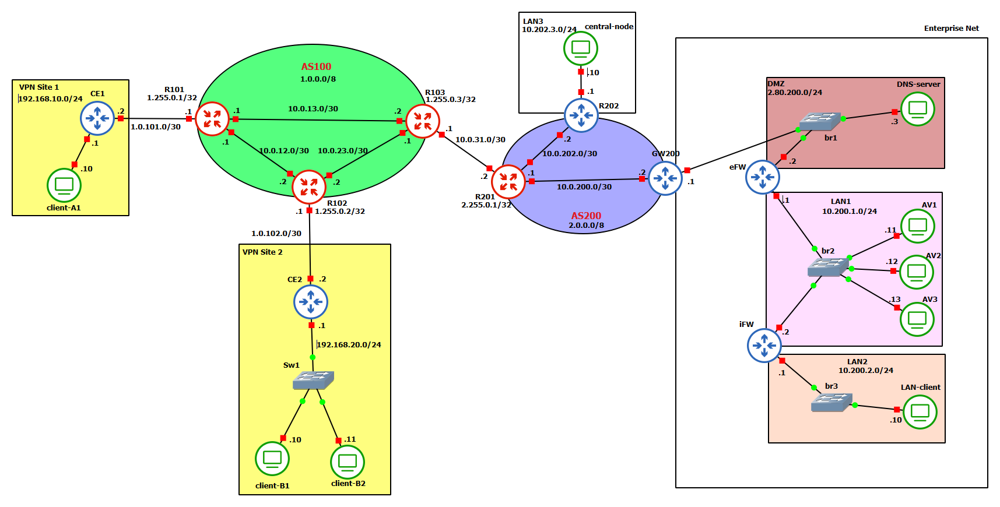

# NSD Project – Deliverable (GNS3)

Questo repository contiene il progetto **NSD** realizzato in **GNS3**, comprensivo di:
- **Routing**: OSPF (intra-AS100) + iBGP (AS100) + eBGP (AS100↔AS200)
- **DMZ**: DNS authoritative con **DNSSEC** + web server HTTP
- **Firewalling**: perimetrale (**eFW**) e interno (**iFW**), con policy stateful
- **VPN IPsec**:
  - **Enterprise**: **R202 ↔ eFW** (LAN3 ↔ LAN1) con strongSwan/**swanctl**
  - **Customer**: **CE1 ↔ CE2** (Site1 ↔ Site2)
- **MACsec con MKA**: protezione L2 in Site2 (client-B1/B2 ↔ CE2)
- **AV sandbox**: 3 runner (AV1–AV3) + nodo centrale (central-node), con reset runner e report

La documentazione dettagliata e i test ripetibili sono in `docs/` (vedi sezione “Documentazione”).

---

## Topologia



### Naming dei nodi (congelato)

**AS100**
- `R101`, `R102`, `R103`

**AS200**
- `R201`, `R202`, `GW200`

**Enterprise Net**
- `eFW` (edge firewall + terminazione IPsec enterprise)
- `iFW` (internal firewall)
- `DNS-server` (DMZ: DNS authoritative + HTTP)
- `LAN-client` (client utente in LAN2)
- `AV1`, `AV2`, `AV3` (LAN1: runner AV)
- `central-node` (LAN3: orchestratore AV)

**Customer VPN**
- `CE1` (Site1), `CE2` (Site2)
- `client-A1` (Site1), `client-B1`, `client-B2` (Site2)
- `Sw1` (switch L2 Site2)

**Bridges (GNS3)**
- `br1` (DMZ), `br2` (LAN1), `br3` (LAN2)

---

## Comandi di verifica rapidi

### Routing (AS100)
Eseguire su `R101/R102/R103`:
```bash
vtysh -c "show ip ospf neighbor"
vtysh -c "show ip bgp summary"
vtysh -c "show ip route"
````

### Servizi DMZ (DNSSEC + HTTP)

Da `LAN-client` (o un nodo con reachability DMZ):

```bash
dig +dnssec @2.80.200.3 www.nsdcourse.xyz A
curl -v http://www.nsdcourse.xyz
```

### VPN IPsec enterprise (R202 ↔ eFW)

Eseguire su `R202` ed `eFW`:

```bash
swanctl --list-sas
```

(Opzionale, utile in demo) Forzare l’avvio del child su `R202`:

```bash
swanctl --initiate --child lan-lan
```

### VPN IPsec customer (CE1 ↔ CE2)

Su `CE1` e `CE2`:

```bash
swanctl --list-sas
```

---

## Piano di indirizzamento (sintesi)

> Dettagli: `docs/01-addressing-plan.md`
> Nota: i prefissi 1.0.0.0/8 e 2.0.0.0/8 sono usati **solo** per laboratorio.

* **Pool pubblici (lab)**:

  * AS100: `1.0.0.0/8`
  * AS200: `2.0.0.0/8`
* **Pool P2P**: `10.0.0.0/16` (link /30)

### Enterprise Net

* **DMZ**: `2.80.200.0/24`

  * GW200 DMZ: `2.80.200.1`
  * eFW outside: `2.80.200.2`
  * DNS-server: `2.80.200.3`
* **LAN1 (AV)**: `10.200.1.0/24`

  * eFW: `10.200.1.1`, iFW: `10.200.1.2`, AV1–3: `.11/.12/.13`
* **LAN2 (client)**: `10.200.2.0/24`

  * iFW: `10.200.2.1`, LAN-client: `10.200.2.10`
* **LAN3 (central)**: `10.202.3.0/24`

  * R202: `10.202.3.1`, central-node: `10.202.3.10`

### Customer VPN

* Site1 LAN: `192.168.10.0/24` (CE1 `.1`, client-A1 `.10`)
* Site2 LAN: `192.168.20.0/24` (CE2 `.1`, client-B1 `.10`, client-B2 `.11`)

  * Nota: quando abilitate MACsec, gli IP della LAN Site2 vengono spostati su `macsec0`.

### Inter-AS (eBGP)

* R103–R201: `10.0.31.0/30` (R103 `.1`, R201 `.2`)

---

## Routing (sintesi)

> Dettagli e comandi: `docs/02-routing.md`

* **AS100**:

  * OSPF area 0 su R101/R102/R103 (core + loopback)
  * iBGP full-mesh tra R101/R102/R103 usando loopback (`1.255.0.1/32`, `1.255.0.2/32`, `1.255.0.3/32`)
* **AS100 ↔ AS200**:

  * eBGP R103 ↔ R201 su `10.0.31.0/30`
  * AS200 annuncia la **DMZ** (`2.80.200.0/24`) verso AS100
* **AS200 (interno)**:

  * connettività interna con static/default (GW200 e R202 con default verso R201)

---

## DMZ: DNS (DNSSEC) + HTTP

> Dettagli: `docs/04-dns-dnssec-web.md`

* `DNS-server` in DMZ (`2.80.200.3/24`) ospita:

  * DNS authoritative per `nsdcourse.xyz` con DNSSEC
  * HTTP per `www.nsdcourse.xyz`

Test tipici:

```bash
dig +dnssec @2.80.200.3 www.nsdcourse.xyz A
curl -v http://www.nsdcourse.xyz
```

---

## Firewall policy (sintesi)

> Policy completa e flussi: `docs/03-firewall-policy.md`

* **Inbound verso DMZ** (lato AS100/esterno): consentiti solo

  * DNS (TCP/UDP 53) verso `DNS-server` (2.80.200.3)
  * HTTP (TCP 80) verso `DNS-server` (2.80.200.3)
  * IPsec verso `eFW` (2.80.200.2): UDP 500/4500 + ESP
* **LAN-client**: outbound consentito solo stateful (connessioni originate da LAN-client)
* **AV runners**: isolamento; traffico consentito solo verso `central-node` (LAN3) tramite VPN enterprise

---

## VPN IPsec

> Dettagli operativi: `docs/05-vpn-ipsec.md`

### Enterprise VPN (R202 ↔ eFW)

* Endpoint: R202 `10.0.202.2` ↔ eFW `2.80.200.2`
* Subnet protette: LAN3 `10.202.3.0/24` ↔ LAN1 `10.200.1.0/24`
* Implementazione strongSwan via **swanctl** (`/etc/swanctl/conf.d/ipsec.conf`)
* Verifica:

```bash
swanctl --list-sas
```

### Customer VPN (CE1 ↔ CE2)

* Site1 LAN `192.168.10.0/24` ↔ Site2 LAN `192.168.20.0/24`
* Verifica:

```bash
swanctl --list-sas
# fallback (se disponibile):
ipsec statusall
```

---

## MACsec con MKA (Site2)

> Dettagli: `docs/06-macsec-mka.md`

* Protezione L2 su Site2 tra CE2 e client-B1/client-B2 (MACsec con MKA)
* Verifica operativa:

```bash
ip -s link show macsec0
ping 192.168.20.1
```

---

## AV sandbox

> Dettagli: `docs/07-av-sandbox.md`

* `central-node` orchestra invio sample, esecuzione scansioni e raccolta risultati
* `AV1`, `AV2`, `AV3` runner isolati
* Dimostrazione richiesta:

  * pipeline completa (invio → scansioni → report)
  * ripristino runner e rerun (“clean state”)

---

## Evidenze (output da salvare)

> Naming completo: `docs/08-test-plan.md`

Salvare gli output in `evidence/`:

* `evidence/01-routing-ospf.txt`
* `evidence/02-routing-bgp.txt`
* `evidence/03-dnssec-dig.txt`
* `evidence/04-http-curl.txt`
* `evidence/05-firewall-tests.txt`
* `evidence/06-ipsec-enterprise.txt`
* `evidence/07-macsec.txt`
* `evidence/08-ipsec-customer.txt`
* `evidence/09-av-sandbox.txt`

---

## Documentazione (indice)

* Scope & assunzioni: `docs/00-scope-and-assumptions.md`
* Addressing plan: `docs/01-addressing-plan.md`
* Routing: `docs/02-routing.md`
* Firewall policy: `docs/03-firewall-policy.md`
* DNS/DNSSEC/Web: `docs/04-dns-dnssec-web.md`
* VPN IPsec: `docs/05-vpn-ipsec.md`
* MACsec MKA: `docs/06-macsec-mka.md`
* AV Sandbox: `docs/07-av-sandbox.md`
* Test plan: `docs/08-test-plan.md`
* Submission checklist: `docs/09-submission-checklist.md`

---

## Struttura repository

* `docs/` documentazione + topologia (`topologia_finale.png`)
* `inventory/` inventario nodi/link/subnet
* `scripts/` script di setup/routing/servizi
* `configs/` dump configurazioni persistenti (se applicabile)
* `evidence/` output comandi, log e prove dei test

---

## Sviluppo (igiene repository)

### Line endings (Windows/macOS/Linux)

Il repository normalizza i file di testo a **LF** tramite `.gitattributes` per compatibilità con ambienti Linux/Docker.

Su Windows è consigliato (nel clone locale):

```bash
git config --local core.autocrlf false
git config --local core.eol lf
```